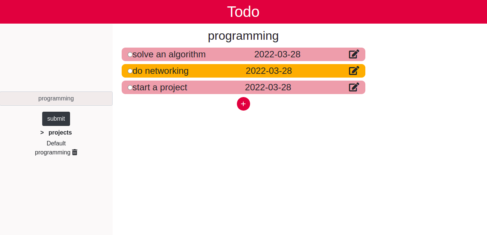

# TodoList
This is a project about to-do's . Projects can be added and tasks(to-do's) added under each project.  The priorities chosen will display a different background color for any todo(task)  The to-do's and projects will be stored on local storage.
 

## Built With

- HTML & CSS
- BOOTSTRAP FRAMEWORK
- Javasript

## Getting started
   To get a local copy up and running follow these simple example steps.
# Setup
- Clone the project locally.
- Run `npm install` followed by  `yarn install` to download all dependencies for the To-do list project.
- Type the command `cd TodoList`
- -Run `npx webpack --watch` to compile all the Js code.
- Use any browser of your choice to open the index.html file (double click on it and options appear then you chose).

## Live Demo

- [Live Demo Link](https://raw.githack.com/che30/TodoList/feature/dist/index.html)
 

## Author
**Che Blanchard**
- GitHub: [@che30](https://github.com/che30)
- LinkedIn: [Che Blanchard](https://www.linkedin.com/in/che-nsoh-9455271b0/)
- Twitter: [@che55085128](https://twitter.com/che55085128)

## Acknowledgements
- The next web
- W3 schools
- Font awesome
- Stack overflow

##  Contributing

Contributions, issues, and feature requests are welcome!

## Show your support

Give a ⭐️ if you like this project!
